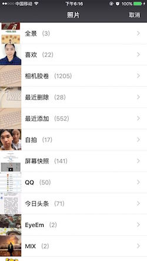
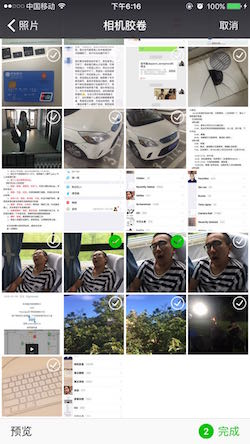
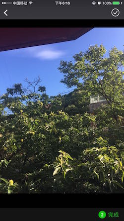

# LLImagePickerController

前些天写了一个仿微信相片选择器的Demo，效果不是很好，而且有些bug，这里我对这个库进行了重构，进行了进一步的扩展，先来看代码:

1. 相片选择器：
```
LLImagePickerController *navigationController = [[LLImagePickerController alloc] init];
// 是否直接跳转到照片选择的页面
navigationController.autoJumpToPhotoSelectPage = YES;
// 是否允许选择返回图片的类型(是否允许选择原图)
navigationController.allowSelectReturnType = YES;
// 最大选择数量
navigationController.maxSelectedCount = 3;
if (iOS8Upwards) {
    // iOS8及以上的系统回调方法
    [navigationController getSelectedPHAssetsWithBlock:^(NSArray<UIImage *> *imageArray, NSArray<PHAsset *> *assetsArray) {
        self.dataArray = [NSArray arrayWithArray:imageArray];
        [self.collectionView reloadData];
    }];
} else {
    // iOS8以下系统回调方法
    [navigationController getSelectedALAssetsWithBlock:^(NSArray<UIImage *> *imageArray, NSArray<ALAsset *> *assetsArray) {
        self.dataArray = [NSArray arrayWithArray:imageArray];
        [self.collectionView reloadData];
    }];
}
[self presentViewController:navigationController animated:YES completion:nil];
```

2. 相机
```
LLCameraViewController *cameraVC = [[LLCameraViewController alloc] init];
// 拍照获取相片回调
[cameraVC getResultFromCameraWithBlock:^(UIImage *image, NSDictionary *info) {
    _imageView.image = image;
}];
[self presentViewController:cameraVC animated:YES completion:nil];
```

相册选择Demo样式如下:









相机Demo样式如下:


如果你喜欢这个Demo，请给个star奥，谢谢大家😊！！！
